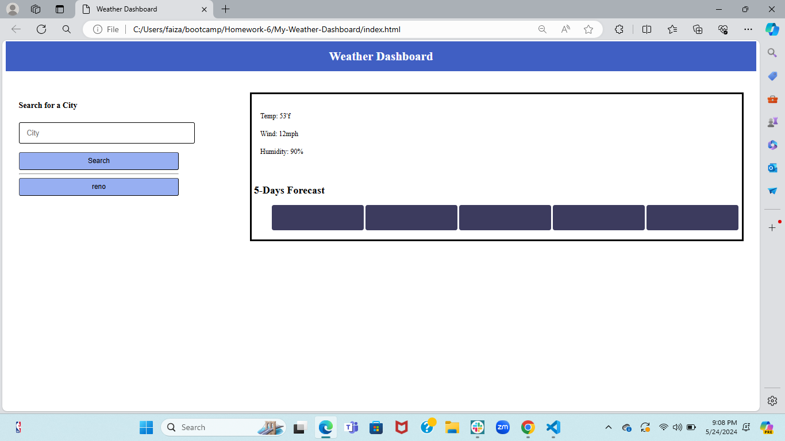
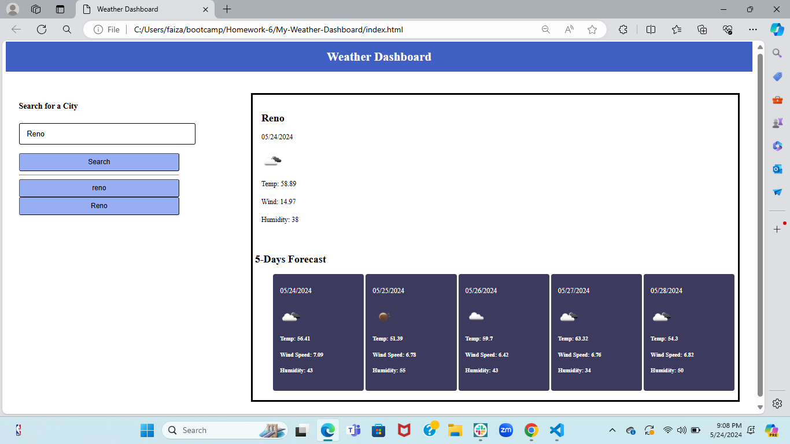
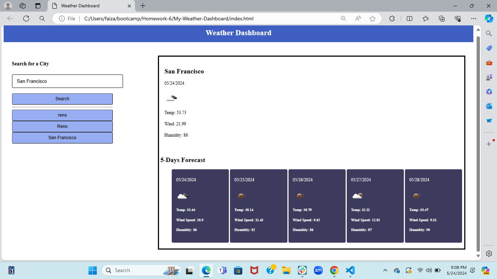

# My-Weather-Dashboard

## Description

* I wanted to create a Weather Dashboard Application allows users to search for a city and retrieve the current weather and forecast for the next four days!The user's search history is stored in localStorage in this application. I utilized server-side APIs, specifically Open Weather API and continues to implement fuctions like addEventListener, and querySelectors. I also applied my skills of localStorage and JSON.parse.

* There was no a starter code given but I used notes from the class lecture and help from other students who have completed the application. I 

* I discovered the following:
-How to request an API key.
-How to construct a query URL and make an API calls using fetch() method.
-How to use localStorage to store the retrieved data.

## Deployed Link
[deployed link](https://faiza-haque.github.io/My-Weather-Dashboard/)

## Screenshot of Project

  

## Credits
- [links]
- [OpenWeatherMap API](https://openweathermap.org/api/)
- [BlackBox] Blackbox code autocomplete is build to make developers faster while writing code. This Machine Learning program helped me with my comments and helped me understand the code I was writing.
- [W3Schools] W3Schools is a free web resource that provides information about HTML, CSS, and JavaScript. It is a great resource for learning web development (https://www.w3schools.com/js/js_json_parse.asp).

## Acknowledgments 
- Tutors and TAs
- My Classmates
- My Instructor
- My Friends
Everyone listed above helped me complete this project. I would like to thank them for their support.